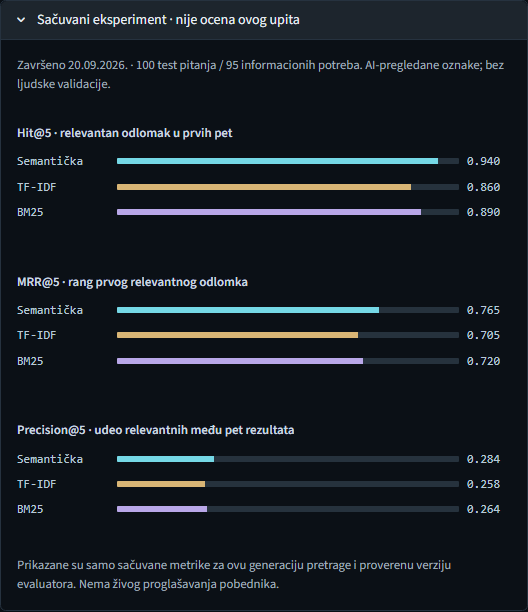

# Lokalna pretraga nastavnih materijala

Python aplikacija koja poredi **TF-IDF, BM25 i semanticku pretragu** nad istim
odlomcima engleskih PDF/TXT materijala. Interfejs je na srpskom. Rezultat je
izvorni odlomak sa dokumentom i stranom, ne generisan odgovor.

Ovaj paket obuhvata aplikaciju, testove, zamrznuti korpus, evaluacioni skup i
rezultate. Ne sadrzi licne Word/PDF radove, fakultetske sablone, lokalno
Python okruzenje, modele niti korisnicke indekse.

## Brzi pocetak - Windows / PowerShell

Provereno razvojno okruzenje: Python 3.14.6, CPU-only PyTorch i Windows 11.
Komande izvrsi iz foldera u kome se nalazi [app.py](app.py).

U netaknutom otpakovanom izdanju prvo proveri integritet (dovoljan je Python,
bez instaliranja zavisnosti):

```powershell
py -3.14 -B -m scripts.verify_release
```

Ova provera ocekuje `release_manifest.json`, koji postoji samo u izgradjenom
paketu, ne u izvornom razvojnom folderu. Proverava se stroga allowlist-a:
posle instalacije ili pokretanja nastaju novi fajlovi, pa tada proveravaj
originalni ZIP umesto radnog direktorijuma.

```powershell
uv sync --locked --group dev --no-build --system-certs
.\.venv\Scripts\python.exe scripts\check_environment.py
```

[pyproject.toml](pyproject.toml) opisuje zavisnosti, a [uv.lock](uv.lock) njihove
tacne verzije. Originalno zakljucano okruzenje koristi Microsoftov PyPI proxy
i zvanicni PyTorch CPU indeks. Dostupnost tih izvora na drugom racunaru nije
garantovana; ne iskljucuj TLS proveru.

Alternativni izvoz istih zakljucanih verzija, bez privatnih korisnickih putanja,
nalazi se u [requirements-runtime.txt](requirements-runtime.txt) i
[requirements-test.txt](requirements-test.txt). Za instalaciju preko javnih
indeksa, u zasebnom okruzenju sa Python-om 3.14:

```powershell
py -3.14 -m venv .venv
.\.venv\Scripts\python.exe -m pip install --require-hashes --index-url https://pypi.org/simple --extra-index-url https://download.pytorch.org/whl/cpu -r requirements-test.txt
```

Ova alternativa ne menja originalni lockfile i zavisi od dostupnosti tacnih
verzija na navedenim javnim indeksima. U slucaju greske ne prelaziti neprimetno
na druge verzije: zabelezi problem i napravi odvojenu, proverenu konfiguraciju.
Puna nova instalacija sa javnih indeksa nije izvrsena u okviru lokalne provere
izdanja; postojece razvojno okruzenje je ponovo upotrebljeno za paketne testove.

### Model i indeks

Model se ne distribuira uz paket. Pre preuzimanja proveri
[njegovo poreklo i status licence](config/model_provenance.json).
Licenca biblioteke nije automatski licenca modelskih tezina.

```powershell
.\.venv\Scripts\python.exe -m src.model --download
.\.venv\Scripts\python.exe -m src.cli index --manifest data\full_corpus_manifest.csv
.\.venv\Scripts\python.exe -m streamlit run app.py --server.address 127.0.0.1 --server.port 8501
```

Otvori [http://127.0.0.1:8501](http://127.0.0.1:8501). Prva instalacija i
preuzimanje modela zahtevaju mrezu. Nakon pripreme model se ucitava lokalno;
tekstovi se ne salju spoljnom servisu za odgovaranje.

Na zamrznutom korpusu ocekuju se **20 dokumenata i 226 odlomaka**.
Dodavanje drugih materijala menja kolekciju i nije ponavljanje ovog eksperimenta.
Nemoj menjati licencne napomene u TXT fajlovima: i one su deo zamrznutih bajtova.

## Pretraga iz terminala

```powershell
.\.venv\Scripts\python.exe -m src.cli search "What is regularization?" --method all
.\.venv\Scripts\python.exe -m src.cli search "What is regularization?" --method bm25
```

`all` poredi tri metode. `both` je kompatibilni naziv za raniji par
semanticka/TF-IDF. BM25 pretraga vec pripremljenog indeksa ne ucitava neuronski model.

## Podaci i rezultati

- [Manifest svih 20 izvora](data/full_corpus_manifest.csv).
- [Licence, autori i uslovi koriscenja](data/LICENSES.txt).
- [Zamrznuti evaluacioni skup v2](data/evaluation/queries_v2.json).
- [Unapred deklarisani protokol](config/evaluation_v2.json).
- [Proverena analiza](artifacts/experiments/test_three_methods_v2/analysis.json).
- [Poreklo podataka i metodologija](docs/DATASET.md).
- [Izabrani, izvorima potkrepljeni slucajevi](docs/error_cases_v2.json).

Skup ima 100 test pitanja, 10 razvojnih i pet odvojenih pitanja bez odgovora.
Relevantnost je procenjena **asistentskim pregledom, ne nezavisnom ljudskom
validacijom**. Metapodaci i pojedinacni razlozi ostaju dostupni.

| Metoda | Hit@5 | MRR@5 | Precision@5 |
| --- | ---: | ---: | ---: |
| TF-IDF | 0.8600 | 0.7053 | 0.2580 |
| BM25 | 0.8900 | 0.7203 | 0.2640 |
| Semanticka | 0.9400 | 0.7652 | 0.2840 |

Ovo su istorijska merenja zamrznute konfiguracije, ne garantovane vrednosti za
proizvoljne materijale. Skorovi razlicitih metoda nisu ista skala pouzdanosti.
Detalji o vremenu i memoriji ostaju u sirovim izvestajima.



## Ponavljanje evaluacije

Novi lokalni indeks dobija novi identifikator generacije. Zbog toga aplikacija
ne predstavlja stari sacuvani eksperiment kao rezultat te nove generacije.
Za novo provereno ponavljanje koristi nepostojece izlazne direktorijume:

```powershell
.\.venv\Scripts\python.exe -m src.evaluation --dataset data\evaluation\queries_v2.json --protocol config\evaluation_v2.json --allow-ai-reviewed --split test --method all --repeats 10 --warmup 3 --seed 42 --output artifacts\experiments\test_reproduction_01
.\.venv\Scripts\python.exe -m src.evaluation --dataset data\evaluation\queries_v2.json --protocol config\evaluation_v2.json --allow-ai-reviewed --split no_answer --method all --repeats 10 --warmup 3 --seed 42 --output artifacts\experiments\no_answer_reproduction_01
.\.venv\Scripts\python.exe -m scripts.analyze_evaluation --run artifacts\experiments\test_reproduction_01 --no-answer artifacts\experiments\no_answer_reproduction_01
```

Za prikaz tog novog izvestaja u aplikaciji:

```powershell
$env:SEMANTIC_SEARCH_REPORT = "artifacts\experiments\test_reproduction_01\analysis.json"
.\.venv\Scripts\python.exe -m streamlit run app.py --server.address 127.0.0.1 --server.port 8501
```

Provere generacije, korpusa i izvrsenog koda ostaju ukljucene. Ne menjati
stare hash vrednosti samo da bi izvestaj bio prikazan.

## Testovi

```powershell
.\.venv\Scripts\python.exe -m pytest tests\unit -q
```

U cistom paketu su testovi aplikacije i evaluacije. Privatni alati za Word,
njihovi testovi i istorijska priprema HTML izvora nisu deo ovog paketa.
Testovi koriste privremene ulaze i ne dokazuju ljudsku ispravnost oznaka.

## Granice sistema

Nema OCR-a, prevoda upita, generisanja odgovora, korisnickih naloga niti
kalibrisanog odbijanja pitanja van kolekcije. Korpus je mali i tematski uzak.
Pooled pregled obuhvata kandidate fiksnih metoda, ne svaku mogucu relevantnost.
Podrska na drugim operativnim sistemima i puna nova instalacija na drugom
racunaru nisu automatski potvrdjene ovim paketom.

## Objavljivanje

Paket je pripremljen lokalno; repozitorijum jos nije javno objavljen i nijedan
GitHub URL nije izmisljen. Prati [uputstvo za objavljivanje](docs/PUBLISHING.md).
Licencu originalnog koda bira autor zasebno; ne pripisuj je tudjim materijalima.

U razvojnom folderu novo izdanje se gradi iskljucivo iz eksplicitne allowlist-e:

```powershell
.\.venv\Scripts\python.exe -B -m scripts.build_release --version 0.1.0-v2-20260921
.\.venv\Scripts\python.exe -B -m scripts.verify_release artifacts\releases\local-search-0.1.0-v2-20260921.zip
```

Graditelj odbija postojeci direktorijum, ZIP ili njegov `.sha256` fajl.
Za narednu iteraciju izaberi novu oznaku; ne menjaj gotovo izdanje.
Manifest sadrzi SHA-256 i velicinu svakog dozvoljenog fajla. To je provera
integriteta, ne digitalni potpis ili garancija odsustva svih poverljivih podataka.
